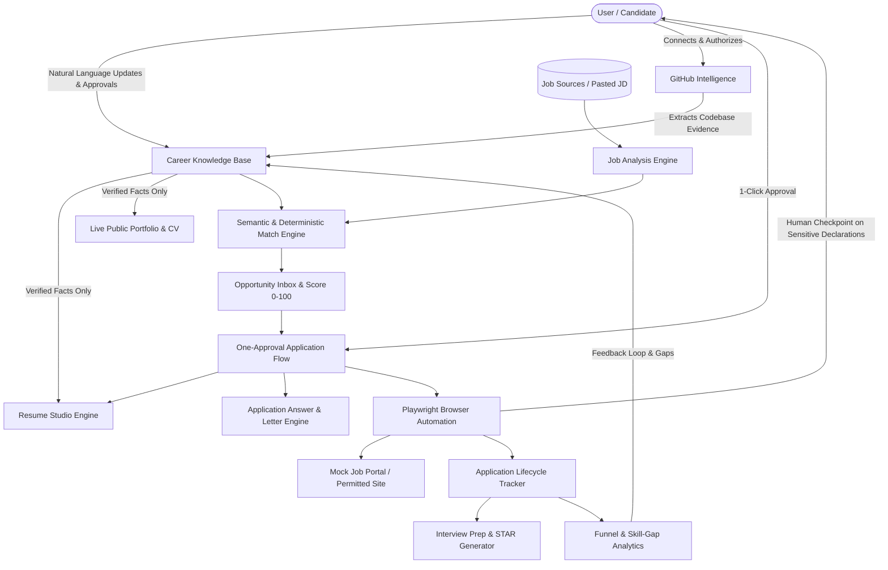

# CareerOS — Personal AI Career & Placement Operating System

> **The Always-Current Career Profile**: A private, single-user, production-ready AI career operating system that maintains **one verified source of truth** about your career and powers role-specific ATS resumes, an always-current public portfolio/CV, explainable semantic job matching, one-approval application workflows, browser-assisted automation with safe checkpoints, interview intelligence, and career analytics.

---

## 🏗️ System Architecture



---

## ⚡ Core Features

- **Verified Career Knowledge Base**: One single source of truth for your profile, skills, projects, experience, education, certifications, and preferences. Every claim links to supporting evidence.
- **Natural-Language "Update My Career" Box**: Converts informal updates (*"I learned Docker and containerized my FastAPI NLP project"*) into structured proposals (Added / Changed / Suggested / Needs clarification) with a human approval gate before committing.
- **GitHub Intelligence**: Inspects authorized repositories, parses dependency manifests and project structures, and suggests contextual evidence proposals without blindly assuming dependencies equal expertise.
- **Explainable Semantic Matching (0–100)**: Multi-factor scoring across mandatory technical skills (30%), project relevance (20%), hard eligibility constraints (15% blocker), role alignment (10%), preferred tech (10%), location (5%), company preference (5%), and feasibility (5%).
- **Resume Studio & ATS Engine**: 7 standard resume families (SWE, Backend Developer, Full-Stack, Data Science, ML/AI, NLP/GenAI, General Placement) with live ATS preview, factuality evidence map audit (0.0% hallucination risk), single-column formatting, and PDF export.
- **Dynamic Public Portfolio & Live CV**: Hosted at `/[slug]` (e.g. `/alex-mercer`) with strict public/private field visibility controls, interactive project showcases, GitHub proof-of-work, and downloadable ATS CV (`/[slug]/cv`).
- **1-Click Application State Machine**: 17 explicit states (`AWAITING_APPROVAL` -> `RESUME_READY` -> `APPLICATION_READY` -> `WAITING_FOR_USER` -> `SUBMITTED` -> `INTERVIEW` -> `OFFER`).
- **Browser Automation with Safety Checkpoints**: Playwright runner for permitted form filling that pauses and requires explicit human confirmation for work authorization, legal attestations, or CAPTCHA/MFA.
- **Interview Prep Center**: Generates role-specific technical deep-dives, behavioral frameworks, and STAR stories from verified projects.
- **Career Analytics & Learning Feedback Loop**: Funnel conversion rates, role family ROI, recurring skill gaps across market postings, and recommended learning projects.
- **Data Portability & Backups**: Full JSON database backup and CSV exports for applications, skills, and profile.

---

## 🤖 What is Automated vs. What Still Requires You?

| Capability | What CareerOS Automates | What Still Requires Human Action / Approval |
| :--- | :--- | :--- |
| **Career Facts** | Extracts structured skills, projects, and diffs from text/repos | **Approval Gate**: You approve/reject before facts become verified |
| **Job Analysis & Fit** | Ingests JDs, extracts requirements, scores 0–100 with evidence breakdown | **One Decision**: You choose whether to apply ("Should I apply? -> YES") |
| **Resume & Answers** | Synthesizes role-tailored ATS bullets & answers from verified data | **Factuality Review**: You can review the Evidence Map audit anytime |
| **Browser Form Filling** | Auto-fills standard fields (name, email, links, work history, resume upload) | **Safety Checkpoints**: Work authorization, legal declarations, CAPTCHA/MFA |
| **Public Portfolio** | Live dynamic rendering of approved public facts & CV | **Privacy Controls**: You choose per-field public/private/selective visibility |

---

## 💻 Technology Stack

- **Frontend**: Next.js 14 App Router, TypeScript, Tailwind CSS, Lucide Icons, Recharts
- **Backend**: Python 3.12+, FastAPI, Pydantic v2, SQLAlchemy, aiosqlite, Playwright, fpdf2
- **Database**: PostgreSQL / SQLite fallback & Supabase Postgres with pgvector support
- **AI Engine**: Google Gemini API (`gemini-2.0-flash` / `gemini-1.5-pro`) with intelligent deterministic offline fallback
- **Automation**: Playwright deterministic browser assistant

---

## 🚀 Quick Start (Local Run)

### 1. Clone & Setup Environment
```bash
git clone https://github.com/alex-mercer-dev/CareerOS.git
cd CareerOS
cp .env.example .env
```

### 2. Start Backend (Port 8000)
```bash
cd backend
python -m pip install -r requirements.txt
python -m uvicorn app.main:app --reload --port 8000
```
*Backend API Docs will be live at `http://127.0.0.1:8000/docs`*  
*Local Mock Application Portal will be live at `http://127.0.0.1:8000/mock-portal`*

### 3. Start Frontend (Port 3000)
```bash
cd ../frontend
npm install
npm run dev
```
*Dashboard will be live at `http://localhost:3000/dashboard`*  
*Public Live Portfolio will be live at `http://localhost:3000/alex-mercer`*

---

## 🧪 Running Automated Tests

Run the full automated test suite verifying matching weights, factuality evidence gates, natural language diff proposals, and export formats:
```bash
cd backend
python -m tests.run_tests
```

---

## 📚 Complete Documentation

- [`docs/ARCHITECTURE.md`](docs/ARCHITECTURE.md) — Comprehensive technical architecture & database schemas
- [`docs/API_SETUP.md`](docs/API_SETUP.md) — Step-by-step credential and environment setup guide
- [`docs/USER_GUIDE.md`](docs/USER_GUIDE.md) — Day-to-day workflow instructions
- [`docs/SECURITY.md`](docs/SECURITY.md) — Privacy boundaries and Row Level Security
- [`docs/AUTOMATION_POLICY.md`](docs/AUTOMATION_POLICY.md) — Safe browser automation and anti-bot policies
- [`docs/DEPLOYMENT.md`](docs/DEPLOYMENT.md) — Production Docker, Supabase, and cloud deployment guide
- [`docs/FINAL_BUILD_REPORT.md`](docs/FINAL_BUILD_REPORT.md) — Final build verification report

---

## 🛡️ License

MIT License © 2026 CareerOS.
